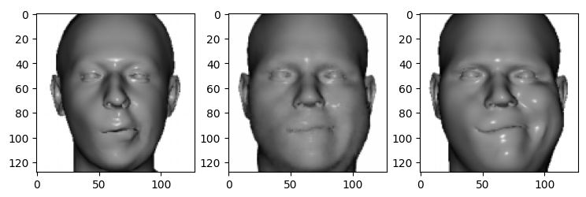
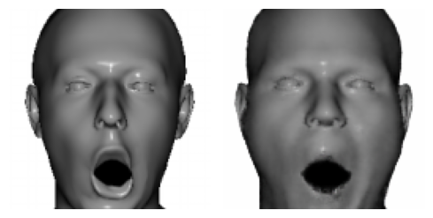
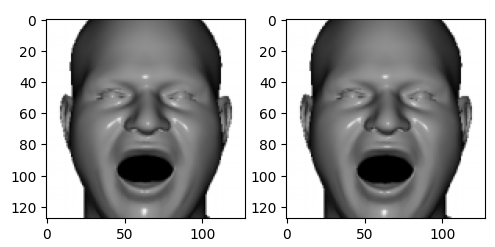

# Facial Animation Retargeting



A modular pipeline for unsupervised facial expression retargeting and 3D blendshape prediction, combining **ReenactNet** (expression transfer) and **BPNet** (blendshape regression). Built with PyTorch and designed for integration with animation tools like Blender/Maya.

## 📖 Overview

This project introduces a two-stage framework:

1. **ReenactNet**: Transfers expressions between faces using a shared latent space autoencoder, trained without paired data.
2. **BPNet**: Predicts interpretable 3D blendshape weights from 2D images, enabling geometric reconstruction via differentiable rendering.

Key features:

- Synthetic dataset generation from the [CoMA dataset](https://coma.is.tue.mpg.de/).
- Unsupervised training with attention mechanisms for robust expression capture.
- End-to-end pipeline bridging 2D reenactment to 3D animation workflows.

## ✨ Features

- 🎭 Expression transfer across identities
- 🎨 3D mesh reconstruction from 2D images
- 🧩 Modular architecture for independent model improvement
- 🚫 No paired training data required

## 🛠 Installation

1. Clone the repository:
   ```bash
   git clone https://github.com/alighasemi78/Facial-Animation-Retargeting.git
   cd Facial-Animation-Retargeting
   ```
2. Download the [CoMA dataset](https://coma.is.tue.mpg.de/).

## 🚀 Usage

The correct order of executing the files can be seen in `main.ipynb` notebook.

## 📊 Results

| Expression Transfer (ReenactNet)                  | Blendshape Prediction (BPNet)                   |
| ------------------------------------------------- | ----------------------------------------------- |
|  |  |

**Quantitative Performance (BPNet):**

- Blendshape Weight MAE: **0.0077**
- Rendered Image MAE: **0.0050**

## 📚 References

1. S. Kim, S. Jung, K. Seo, R. B. i Ribera, J. Noh, [Deep learning-based unsupervised human facial retargeting](https://onlinelibrary.wiley.com/doi/abs/10.1111/cgf.14400), Computer Graphics Forum 40 (2021) 45–55.
2. [CoMA Dataset](https://coma.is.tue.mpg.de/)
